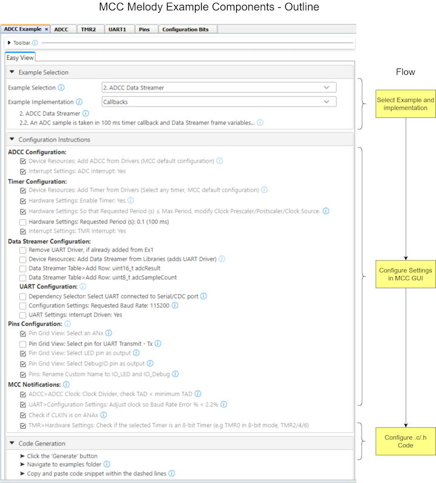
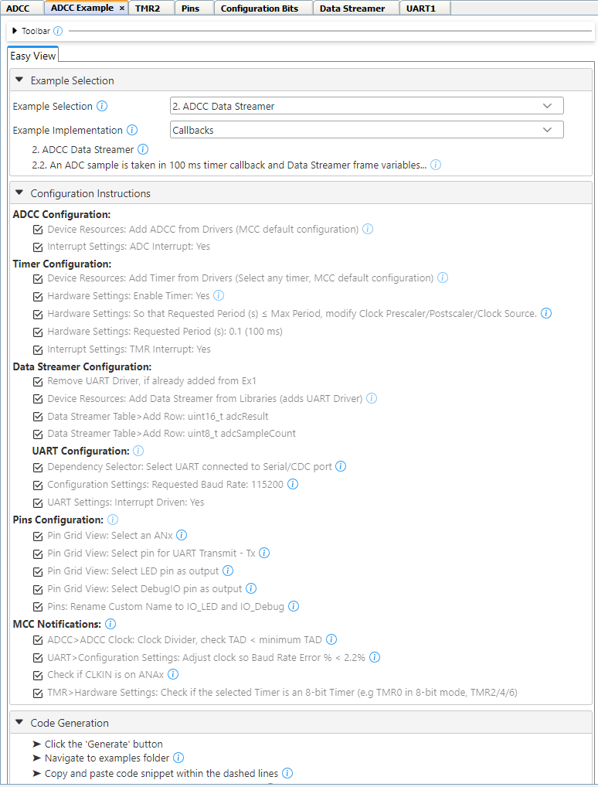
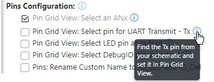
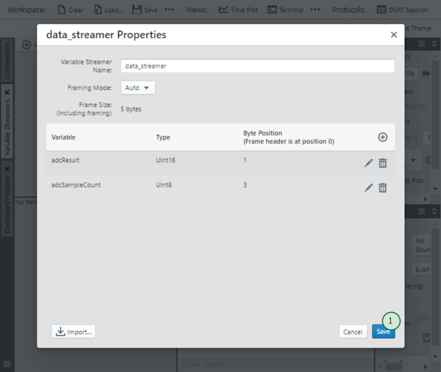
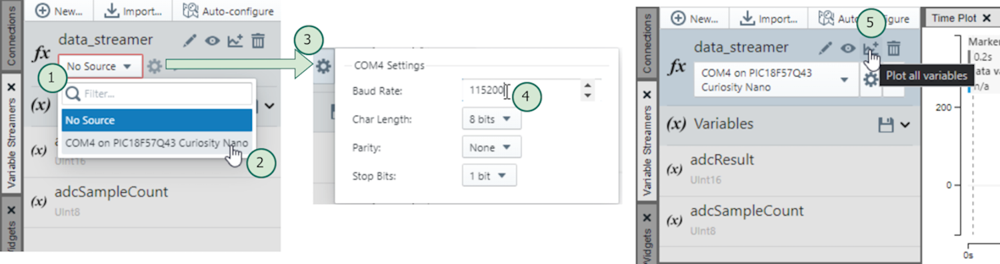
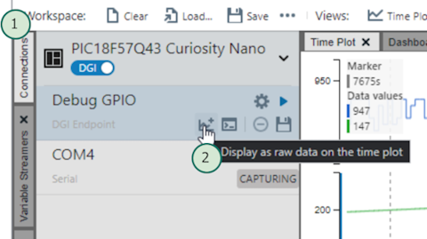
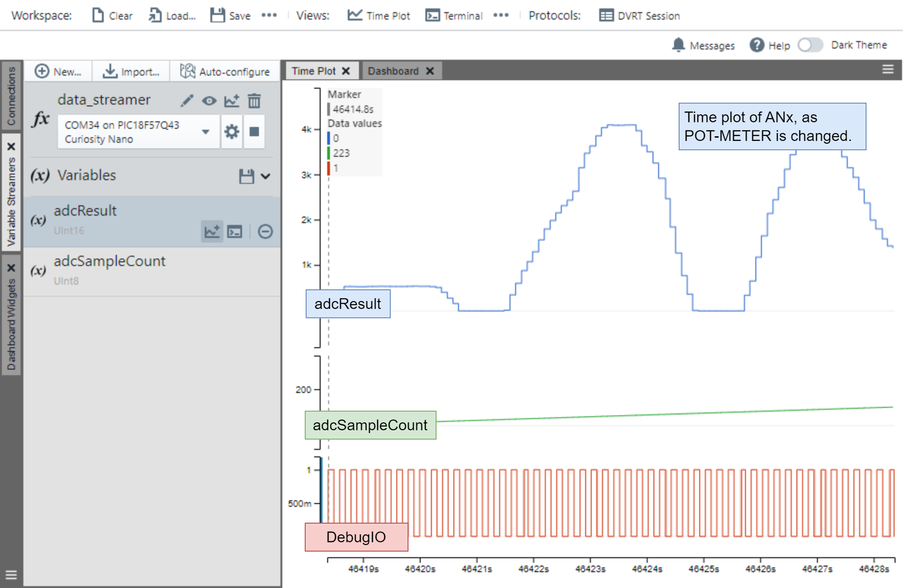
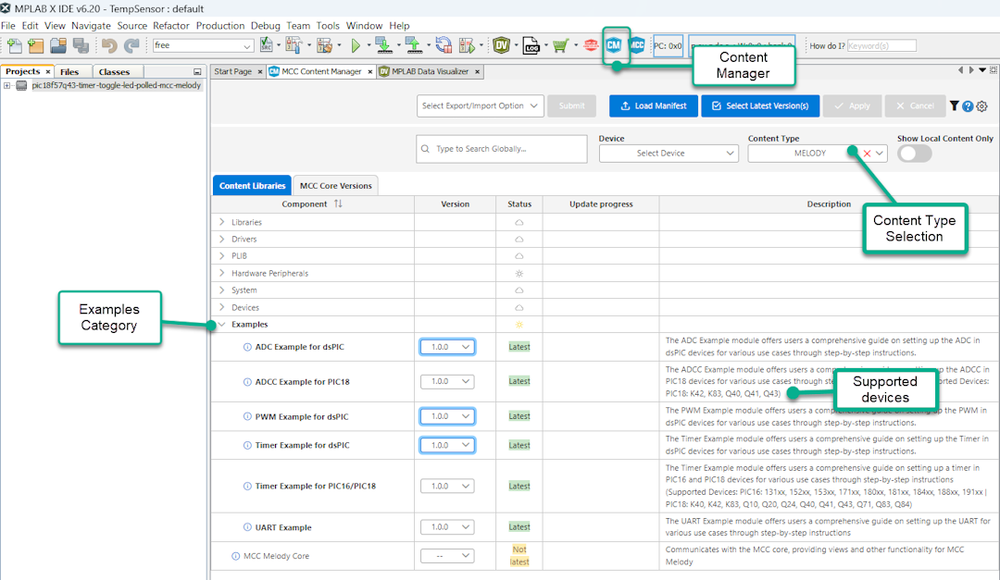

<a target="_blank" href="https://www.microchip.com/" id="top-of-page">
   <picture>
      <source media="(prefers-color-scheme: light)" srcset="images/mchp_logo_light.png" width="350">
      <source media="(prefers-color-scheme: dark)" srcset="images/mchp_logo_dark.png" width="350">
      
   </picture>
</a>

# MCC Melody ADC Data Streamer Printf Example - Callbacks Implementation (PIC18F57Q43)

The [ADC Data Streamer example](https://onlinedocs.microchip.com/v2/keyword-lookup?keyword=MCC.MELODY.EXAMPLES.RUNNING.ADCC.DATA.STREAMER&version=latest&redirect=true "Analog-to-Digital Conversion (ADC) Data Streamer example"), of the MCC Melody ADCC Example Component, is used in the Callbacks Implementation.  Displays ADCC samples visualized with the Data Streamer. An ADC conversion is taken every 100 ms on the selected analog channel, also toggling a LED and Debug GPIO. 

## MCC Melody Example Components
Example Components are a tight integration of learning material directly into MCC. This allows users to conveniently place configuration instructions side-by-side to the components they are configuring. For more information, refer to the [MCC Melody Example Components Introduction](https://onlinedocs.microchip.com/v2/keyword-lookup?keyword=MCC.MELODY.EXAMPLES&version=latest&redirect=true). 

**Note:** The image below shows the ADCC Example Component, as it would be moving to the ADCC Data Streamer (Callbacks Implementation), having implemented the ADCC Basic Printf (Callbacks Implementation). In this case a diff between the two examples is shown. 

Complete projects, available in [MPLAB® Discover](https://mplab-discover.microchip.com) or GitHub, are specific to a board and microcontroller. However, the current project could be recreated on a range of supported microcontrollers by following the steps in the example component.

To explore what an example component is, as well as the difference between example and implementation, see [MCC Melody Example Components - The Basics](https://onlinedocs.microchip.com/v2/keyword-lookup?keyword=MCC.MELODY.EXAMPLES.BASICS&version=latest&redirect=true).

Example Components are related to [MCC Melody Design Patterns for Control Flow](https://onlinedocs.microchip.com/g/GUID-7CE1AEE9-2487-4E7B-B26B-93A577BA154E), which shows different standard ways to organize `main.c` and other application-level files, such as Polling, Interrupt and Callback, or State Machine Design Patterns. Users might be familiar with each of these patterns, but...
- What support does MCC Melody provide for each?
- What are the recommended ways of building on the MCC Melody generated code? 

## Software Used
- MPLAB® X IDE 6.20.0 or newer [(MPLAB® X IDE 6.20)](https://www.microchip.com/en-us/development-tools-tools-and-software/mplab-x-ide)
- MPLAB® XC8 2.46.0 or newer [(MPLAB® XC8 2.46)](https://www.microchip.com/en-us/tools-resources/develop/mplab-xc-compilers/xc8)

- MPLAB® Code Configurator (MCC) Plugin Version 5.5.1 or newer (*Tools>Plugins>Installed*, search: "MCC")
- ADC Converter with Computation (ADCC) Example Component 1.0.0 or newer
- MCC Core 5.7.1 or newer 
- MCC Melody Core 2.7.1 or newer (Communicates with the MCC core, providing views and other functionality for MCC Melody)

  

## Hardware Used
- PIC18F57Q43 Curiosity Nano [(DM164150)](https://www.microchip.com/en-us/development-tool/DM164150)
- Curiosity Nano Explorer [(EV58G97A)](https://www.microchip.com/en-us/development-tool/EV58G97A)

## Setup
All instructions required to recreate this example are listed below, under Configuration Instructions.   

Once you have loaded the project in MPLAB X IDE, you will also be able to find more information from Tooltips and links next to the instructions 
.

## Operation
The image below shows the [ADCC Basic Printf example](https://onlinedocs.microchip.com/v2/keyword-lookup?keyword=MCC.MELODY.EXAMPLES.RUNNING.ADCC.PRINTF&version=latest&redirect=true
) running, using the MPLAB Data Visualizer. 

1) Click the  icon to open the MPLAB Data Visualizer.
2) Under the *Variable Streamers* tab (on the left hand side), click the  button, to import a *.ds* file.
3) From your project root, navigate into *mmc_generated_files/data_streamer/* directory.
4) Click on the *data_streamer.ds* file to select it. 
5) Then click the  button, to load the ds file.

You should see a *data_streamer Properties* window, showing the *adcResult* and *adcSampleCount* variables loaded. 

1) Click the  button, to load this data streamer configuration. 

1) Click on the  button.
2) Select your board from those available. 

   **Note:** If your board is not recognised by the MPLAB Data Visualizer, got to the Device Manager (Windows), to determine the COMx number.  

3) Click on the  icon, to bring up the COMx Settings. 
4) Set the baud rate to 115200, then click out of the window to close the settings. 
5) Click the  icon, to plot all variables. 

1) Click on the *Connections* button.
2) Under Debug GPIO, click the  icon, to add to the time plot.

If all is correct, when changing the pot meter value, you should see similar results to the below image.  

## Summary
For more example components, open the stand-alone Content Manager  in MCC. 

 

